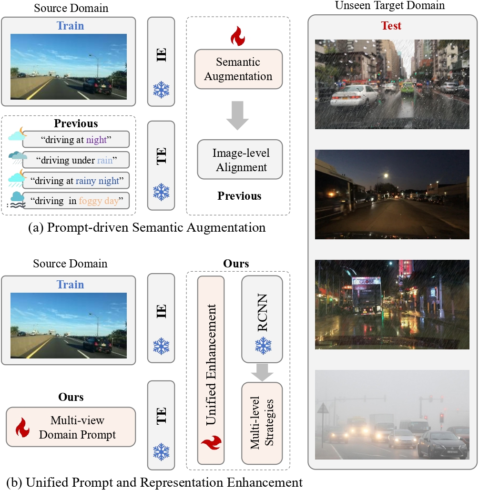

<h1 align="center">
[ICCV2025] UPRE: Zero-Shot Domain Adaptation for Object Detection via Unified Prompt
and Representation Enhancement
</h1>

[](https://arxiv.org/abs/2507.00721)  
### This is official implementation of UPRE.

<div align="center">
  
</div>

<!-- Converge much faster just with weight initialization from pretrain. 
 -->

## Introduction
Zero-shot domain adaptation (ZSDA) presents substantial challenges due to the lack of images in the target domain. Previous approaches leverage Vision-Language Models (VLMs) to tackle this challenge, exploiting their zero-shot learning capabilities. However, these methods primarily address domain distribution shifts and overlook the misalignment between the detection task and VLMs, which rely on manually crafted prompts. To overcome these limitations, we propose the unified prompt and representation enhancement (UPRE) framework, which jointly optimizes both textual prompts and visual representations. Specifically, our approach introduces a multi-view domain prompt that combines linguistic domain priors with detection-specific knowledge, and a visual representation enhancement module that produces domain style variations. Furthermore, we introduce multi-level enhancement strategies, including relative domain distance and positive-negative separation, which align multi-modal representations at the image level and capture diverse visual representations at the instance level, respectively. Extensive experiments conducted on nine benchmark datasets demonstrate the superior performance of our framework in ZSDA detection scenarios.


## Future Tasks
```
[1]: Update Github (✔️)
[2]: Update Code ( )
[3]: Release Checkpoints ( )
```


## Acknowledgement

Our  code are based on  [CLIP-GAP](https://github.com/vidit09/domaingen), [CoOp](https://github.com/KaiyangZhou/CoOp), [DetPro](https://github.com/dyabel/detpro). Thanks for their great work.

## Citation
```
@article{zhang2025upre,
  title={UPRE: Zero-Shot Domain Adaptation for Object Detection via Unified Prompt and Representation Enhancement},
  author={Zhang, Xiao and Wei, Fei and Wang, Yong and Zhao, Wenda and Li, Feiyi and Chu, Xiangxiang},
  journal={arXiv preprint arXiv:2507.00721},
  year={2025}
}
```